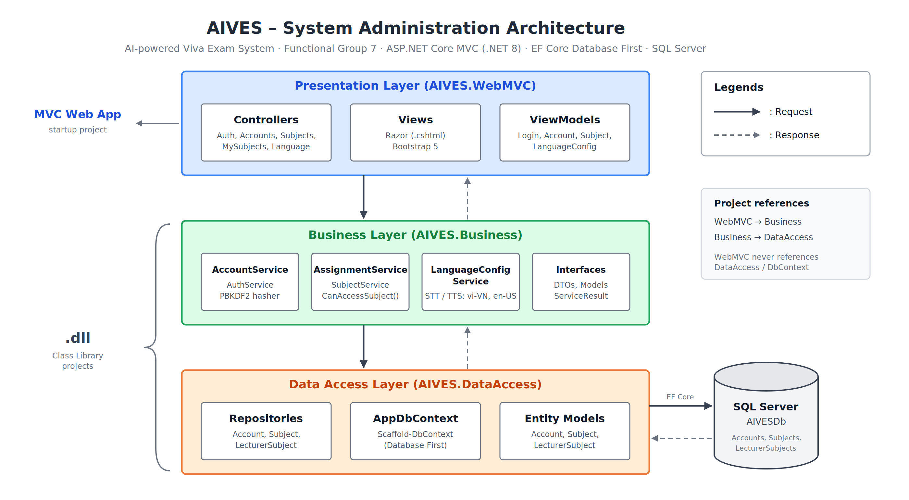

# AIVES – Nhóm 4: Chức năng 7, Quản trị hệ thống (Assignment 1)

**AIVES – AI-powered Viva Exam System** (Hệ thống thi vấn đáp thông minh có sử dụng AI).

Đề tài AIVES gồm 7 chức năng. Theo yêu cầu Assignment 1, mỗi nhóm chọn một chức năng để làm trước; **Nhóm 4** chọn **Chức năng 7: Quản trị hệ thống** (quản lý tài khoản, phân quyền giảng viên/môn học, cấu hình ngôn ngữ Việt/Anh cho STT/TTS). Đây là nền móng các chức năng còn lại dùng chung:

- Chức năng 1, 2, 4, 6 gọi `IAssignmentService.CanAccessSubjectAsync` để biết giảng viên có quyền trên môn học hay không.
- Chức năng 3 (Lõi phỏng vấn AI) gọi `ILanguageConfigService.GetSpeechConfigAsync` để biết giám khảo AI đọc câu hỏi (TTS) và nhận dạng câu trả lời (STT) bằng tiếng gì.

ASP.NET Core MVC (.NET 8) + EF Core **Database First** + SQL Server, kiến trúc 3 lớp tách thành 3 project.



## 1. Kiến trúc

```
AIVES.sln
├── Database/AIVESDb.sql       Script tạo database + dữ liệu mẫu (nguồn gốc của mọi thứ)
├── AIVES.DataAccess   (.dll)  Entities + AppDbContext (scaffold từ DB), Repositories
├── AIVES.Business     (.dll)  Services, Interfaces, DTOs, Models, ServiceResult   → ref DataAccess
└── AIVES.WebMVC       (MVC)   Controllers, Views, ViewModels                      → ref Business
```

Luồng một request: `View → Controller → Service (Business) → Repository → DbContext → SQL Server`, rồi kết quả đi ngược lên.

Các nguyên tắc đã áp dụng:

- Controller không bao giờ dùng `AppDbContext` hay Entity. Nó chỉ gọi interface của Business.
- Entity (DataAccess) → DTO (Business) → ViewModel (WebMVC). Mỗi tầng có kiểu dữ liệu riêng.
- WebMVC đăng ký toàn bộ tầng dưới bằng một dòng `builder.Services.AddBusinessLayer(connStr)`.
- Mọi luật nghiệp vụ và kiểm tra quyền nằm trong Service, trả về `ServiceResult` (thành công / lỗi nghiệp vụ / không tìm thấy / không có quyền).

## 2. Chức năng

| Chức năng | Admin | Giảng viên |
|---|---|---|
| Đăng nhập / đăng xuất (Cookie Authentication) | ✔ | ✔ |
| Quản lý tài khoản: tìm, tạo, sửa, khóa/mở khóa, đặt lại mật khẩu | ✔ | |
| Phân công / gỡ phân công giảng viên theo môn học | ✔ | |
| Cấu hình ngôn ngữ STT/TTS (Việt/Anh) theo môn học | mọi môn | chỉ môn được phân công |

Giả định thiết kế: ngôn ngữ STT/TTS được cấu hình **theo từng môn học**. Môn học bằng tiếng Anh thì giám khảo AI đọc câu hỏi và nhận dạng câu trả lời bằng tiếng Anh.

Luật nghiệp vụ ở tầng Business:

- Email không trùng, mật khẩu ≥ 6 ký tự, băm mật khẩu bằng PBKDF2.
- Không tự khóa hoặc tự đổi vai trò của chính mình; không khóa/hạ quyền quản trị viên cuối cùng.
- Không đổi vai trò giảng viên khi còn đang được phân công môn.
- Chỉ phân công tài khoản Giảng viên đang hoạt động, vào môn đang mở, không phân công trùng.
- Giảng viên chỉ sửa được ngôn ngữ của môn mình được phân công (kiểm tra ở Service, không chỉ ở Controller).
- Tài khoản bị khóa hoặc bị đổi vai trò sẽ bị đăng xuất ở request kế tiếp.

## 3. Cách chạy (Database First)

1. Mở SSMS, chạy file `Database/AIVESDb.sql`. Script tạo database `AIVESDb`, 3 bảng và dữ liệu mẫu (mật khẩu đã băm sẵn).
2. Sửa connection string trong `AIVES.WebMVC/appsettings.json` cho đúng SQL Server của bạn. Ví dụ dùng tài khoản sa:
   `Server=localhost;Database=AIVESDb;User Id=sa;Password=<mật khẩu>;TrustServerCertificate=True`
3. Đặt `AIVES.WebMVC` làm Startup Project rồi chạy (F5).

Các file trong `AIVES.DataAccess/Entities` và `AppDbContext.cs` **đã được scaffold sẵn** từ script trên, bạn không cần chạy lệnh gì thêm.

### Khi sửa database (thêm cột, thêm bảng)

Sửa trong SQL Server trước (và cập nhật lại file `.sql`), rồi scaffold lại. Trong Package Manager Console:

```
Scaffold-DbContext "Name=ConnectionStrings:DefaultConnection" Microsoft.EntityFrameworkCore.SqlServer -OutputDir Entities -ContextDir . -Context AppDbContext -Namespace AIVES.DataAccess.Entities -ContextNamespace AIVES.DataAccess -Project AIVES.DataAccess -StartupProject AIVES.WebMVC -NoOnConfiguring -Force
```

Hoặc dùng CLI (chạy ở thư mục chứa file .sln):

```
dotnet tool install --global dotnet-ef --version 8.*
dotnet ef dbcontext scaffold "Name=ConnectionStrings:DefaultConnection" Microsoft.EntityFrameworkCore.SqlServer --output-dir Entities --context-dir . --context AppDbContext --namespace AIVES.DataAccess.Entities --context-namespace AIVES.DataAccess --project AIVES.DataAccess --startup-project AIVES.WebMVC --no-onconfiguring --force
```

Lưu ý:

- `-NoOnConfiguring` để connection string không bị ghi cứng vào `AppDbContext`. Nó được truyền từ `appsettings.json` qua `AddBusinessLayer`.
- `-Force` sẽ ghi đè các file scaffold. Vì vậy **không viết code tay vào Entities hay AppDbContext**. Nếu cần cấu hình thêm, viết vào một file `partial` riêng (hàm `OnModelCreatingPartial`).

Tài khoản mẫu:

| Email | Mật khẩu | Vai trò | Được phân công |
|---|---|---|---|
| admin@fu.edu.vn | Admin@123 | Quản trị viên | |
| an.nv@fu.edu.vn | Lecturer@123 | Giảng viên | PRN222 |
| binh.tt@fu.edu.vn | Lecturer@123 | Giảng viên | ENW492c |

Môn mẫu: PRN222, SWP391, ENW492c (tiếng Anh), SSG104, PRN211 (đã ngừng).

## 4. Main flow để demo: phân quyền giảng viên theo môn học (khoảng 5 phút)

1. Đăng nhập `admin@fu.edu.vn`. Trang Môn học hiện danh sách, ENW492c đang dùng en-US.
2. Vào Tài khoản, tạo giảng viên mới, ví dụ `chau.lm@fu.edu.vn` / `Lecturer@123`. Thử tạo lại cùng email để thấy lỗi "Email đã được dùng", đây là luật ở tầng Business.
3. Vào Môn học → SWP391 → phân công giảng viên vừa tạo.
   - Mở trang này ở 2 tab, phân công cùng một người ở cả hai: tab thứ hai báo "đã được phân công trước đó".
   - Vào PRN211 (đã ngừng) và phân công: bị chặn "môn đã ngừng hoạt động".
4. Đăng xuất, đăng nhập bằng giảng viên mới. "Môn của tôi" chỉ có SWP391. Đổi STT sang English và lưu.
5. **Điểm nhấn:** vẫn bằng giảng viên này, gõ tay URL `/Language/Edit?subjectId=<id của PRN222>`. Hệ thống chặn và chuyển sang trang "Không có quyền". Controller cho mọi người đã đăng nhập vào, chính **tầng Business** mới là nơi quyết định quyền.
6. Mở `/Language/Speech?subjectId=<id của SWP391>` để thấy JSON `{"subjectCode":"SWP391","sttLocale":"en-US",...}`. Đây là dữ liệu Chức năng 3 (Lõi phỏng vấn AI) sẽ dùng khi mở phiên thi vấn đáp.
7. (Thêm nếu còn thời gian) Mở 2 trình duyệt: Admin khóa tài khoản giảng viên, bên giảng viên bấm tải lại là bị đăng xuất ngay.

Khi trình bày code, đi theo đúng một đường: `SubjectsController.Assign` → `AssignmentService.AssignAsync` → `LecturerSubjectRepository.AddAsync` → `AppDbContext`.

## 5. Mẹo thêm (tùy chọn)

Mặc định .NET cho phép WebMVC "nhìn thấy" DataAccess qua tham chiếu bắc cầu. Nếu muốn trình biên dịch chặn luôn việc Controller dùng DbContext, thêm vào `AIVES.WebMVC.csproj`:

```xml
<PropertyGroup>
  <DisableTransitiveProjectReferences>true</DisableTransitiveProjectReferences>
</PropertyGroup>
```

Nếu sau khi thêm mà lệnh scaffold báo lỗi, bỏ dòng này đi. Bản hiện tại đã tuân thủ quy tắc bằng cách viết code, không cần dòng này để chạy.
