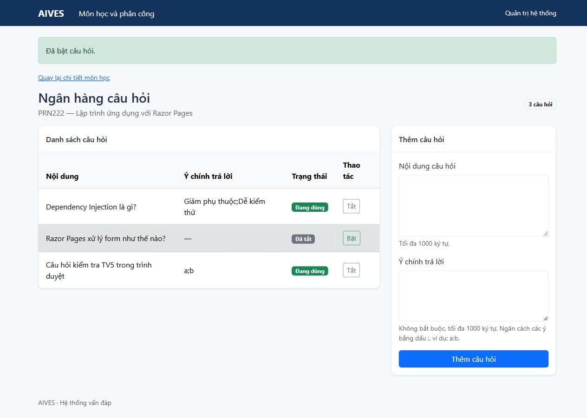
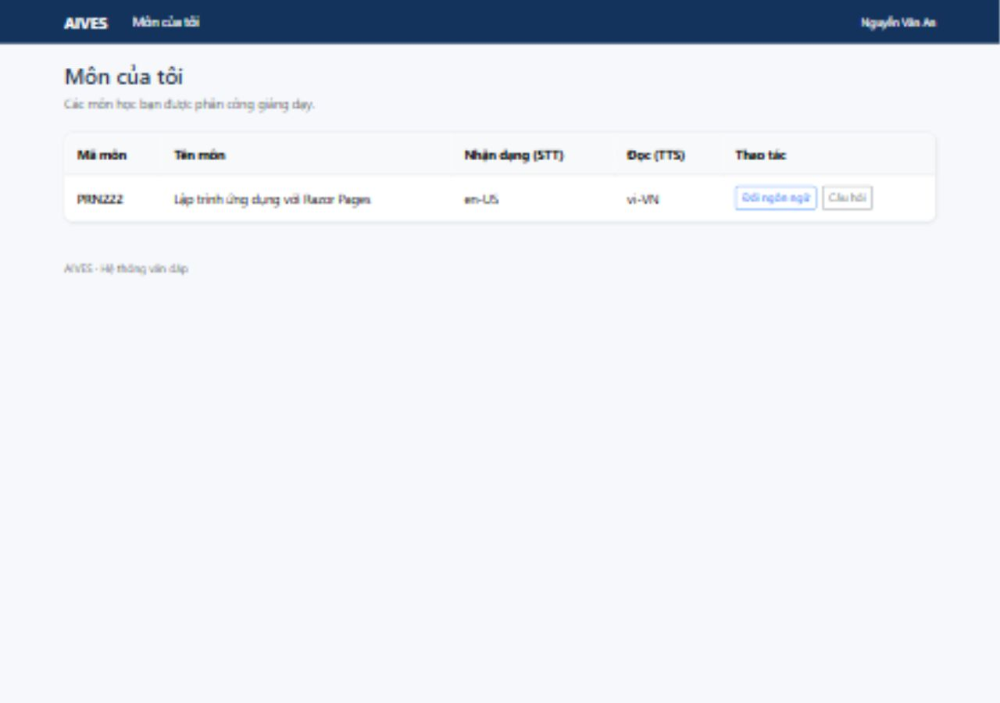

# TV5 Ass2 implementation and handoff

Verified: 10 October 2026. Working project: `AIVES-project`, feature branch `TV5-ass2-questions-subjects-language`, based on `assignment-2`.

## Status

TV5 tasks 5.1, 5.2 and 5.3 are implemented and verified in isolation. Full Ass2 completion is **blocked by the unfinished dependencies below**. The question-editing mini-task is deferred on the user's explicit instruction; no shared interface was changed.

| Work | Delivered | Verification |
|---|---|---|
| 5.1 Question allocation | Distinct sets, neighbour exclusion when capacity allows, usage ranking and the caller's RNG; explicit invalid-input handling | Original 6/6 allocator checks pass; additional checks exercise 4,080 size/seed combinations (20 students each), duplicate pool entries and reproducibility |
| 5.1 Question management | Read including inactive questions, add with trimming/1000-character limits/null optional points, turn on/off with subject access checked before writes | 17/17 isolated question checks pass with real TV5 service and in-memory repository; permission service is a named test double |
| 5.2 Subjects | Admin-only list/details, stopped-subject styling, counts, assignment/removal, language and question-bank links | Automated HTTP flows and browser list/details checks with test dependencies |
| 5.2 MySubjects | Lecturer-only list from `GetByLecturerAsync`, language/question links | HTTP checks and browser inspection: An sees only PRN222 |
| 5.2 Language | Authorized GET and POST through `ILanguageConfigService`; valid saves redirect by role; errors retain submitted values; update time/author displayed | HTTP flows and browser English STT save verified with test dependencies |
| 5.3 Question bank | List/add/on/off, inactive labels, semicolon points, permission errors, 404s, scoped toggle IDs, malformed/missing toggle state rejected | HTTP form/security checks and browser add/off/on verified with real `QuestionService` and test dependencies |
| Mini-task: editing | Not implemented, by user instruction | Waiting for Tien's agreement on the shared interface and added tests |

No production `Program.cs`, repositories, TV3 services, shared interfaces/DTOs/models/entities or original tests were modified. The branch is prepared for review against `assignment-2`; team approval and merge remain pending. See `TV5_ASS2_PROGRESS.md` for the Vietnamese progress report.

## What other members need to finish

| Owner | Files/work needed | Effect on TV5 |
|---|---|---|
| **TV3** | `AssignmentService.CanAccessSubjectAsync`, `AssignAsync`, `UnassignAsync`; `SubjectService`; `LanguageConfigService` | The original 9 QuestionService checks all stop at the empty `CanAccessSubjectAsync`. Real subject/assignment/language page flows cannot run yet. Locked, missing, Pending and unassigned accounts must be rejected by the shared permission service. |
| **TV2** | Question/subject/account/assignment repositories and `AddDataAccessLayer` | SQL-backed reading and writing is still unavailable. `QuestionRepository`'s four methods are empty. Verify SQL schema/data using the correct Ass2 scripts and a separate test database. |
| **TV6** | `AddBusinessLayer`, real `Program.cs`, `AddRazorPages`, cookie validation and role policies, application navigation/layout; exam pages | Production `Program.cs` still serves only the starter text. Register TV5's service/interfaces, map pages and validate account activity/role on every request before integration testing. |
| **TV4** | Login/logout/AccessDenied pages, connected to TV3's auth service | TV5 pages require authenticated claims and a working forbidden destination. |
| **TV3 + TV6** | Implement/connect `ExamService` create/reallocate and exam UI | Verify that disabled questions are excluded and neighbouring students still do not overlap after reallocation. The allocator itself passes its independent tests, but this integration is not verified. |
| **Tien** | Approve `IQuestionService` editing addition and extra tests | The editing mini-task must remain pending until agreement. |
| **TV3 / Tien** | Cross-review, real checklist C/D/E, PR review and integration | Full acceptance, PR and merge conditions remain open. |

### Foundation integration details

- Pages declare their roles with `[Authorize(Roles = ...)]`; services remain responsible for subject permissions and business rules.
- TV5's `Pages/TV5PageModel.cs` contains only claim access, TempData success, error mapping and a missing/malformed identity guard. It is independent of the pending TV6 `AppPageModel`. Consolidate these helpers when TV6's base is ready.
- The TV5-only layout is `Pages/Shared/_TV5Layout.cshtml`. It uses Bootstrap 5, page titles, role navigation and TempData notices. To adopt TV6's shared layout, change the three folder `_ViewStart.cshtml` files and the layout declaration in `Pages/Exams/Questions.cshtml`. No placeholder foundation was added to production `Program.cs`.
- `Forbid()` hands forbidden results to the configured authentication scheme. Configure the cookie AccessDenied destination to `/Auth/AccessDenied`.
- All POST forms use the Razor form tag helper and antiforgery tokens. Successful writes redirect; validation errors re-render with posted values.
- Question-bank POSTs first load and authorize the requested bank. A toggle for an ID outside that bank returns 404; `QuestionService` additionally verifies the stored question's subject before mutation.

## Verification results

| Check | Actual result |
|---|---|
| `dotnet build AIVES.Ass2.sln --no-restore -m:1` | Passed: 0 warnings, 0 errors |
| Original TV5 tests before implementation | 0 passed / 15 failed, all TV5 methods empty |
| Original TV5 tests after implementation | 6 passed / 9 failed; all failures now originate in TV3 `AssignmentService.CanAccessSubjectAsync` |
| `tools/TV5.Verify` | 23 passed / 0 failed: 17 question cases, 1 complete page flow, 5 restricted-account route cases |
| Full original `AIVES.Tests` | 6 passed / 121 failed / 127 total; failed groups below |
| `AIVES.Tests.Data` | 0 passed / 0 failed / **22 discovered cases skipped**, because `AIVES_TEST_CONNECTION` is unset; SQL is not verified |
| Browser temporary preview | Checked normal narrow viewport and 1280px desktop layout; empty assignment message, language save, bank add/off/on, lecturer subject list |
| Browser access-denial display | The in-app browser blocked navigation to the preview's 403 destination, so the denial screen itself was not visually verified. Automated HTTP GET/POST checks confirm the correct forbidden redirect and no mutation. |
| Independent code review | No remaining critical/important findings. Found omitted toggle state, reproduced it with a failing HTTP test, fixed it and re-ran successfully. Suggested splitting the long page-flow test as a future maintenance improvement. Reviewer inspection is not a team-member acceptance review. |
| Diff checks | `git diff --check` passes; no unfinished methods in TV5 production files; web pages contain no DataAccess/DbContext references |

The full original Business failures are in `PasswordHasherTests` (9), `AuthServiceTests` (9), `AccountServiceTests` (33), `AssignmentServiceTests` (10), `SubjectServiceTests` (4), `LanguageConfigServiceTests` (6), `QuestionServiceTests` (9, blocked by AssignmentService), and `ExamServiceTests` (41). Their source methods remain unimplemented outside TV5 scope. Exact failing case names and stack traces are in the generated TRX results.

### Re-run from the project folder

```powershell
dotnet restore AIVES.Ass2.sln -p:NuGetAudit=false
dotnet build AIVES.Ass2.sln --no-restore -m:1
dotnet test AIVES.Tests --no-restore -m:1 --filter "FullyQualifiedName~QuestionAllocatorTests|FullyQualifiedName~QuestionServiceTests"
dotnet test AIVES.Tests --no-restore -m:1
dotnet test AIVES.Tests.Data --no-build --no-restore
dotnet restore tools/TV5.Verify -p:NuGetAudit=false
dotnet test tools/TV5.Verify --no-restore -m:1
```

The standard test packages were downloaded successfully on an unrestricted retry; their original versions were preserved. The sandbox's test runner stalled on local communication; the passing/failing results above come from a rerun with local process/localhost access enabled. Single-worker `-m:1` builds avoid the restricted environment's silent parallel-build failure.

Local generated results are in `tools/TV5.Verify/TestResults/` (`isolated-before.trx`, `tv5-after.trx`, `isolated-all.trx`, `business-all.trx`, `data-all.trx`, `sandbox-aborted.trx`). The initial sandboxed runner timed out and its aborted record is kept separately in `sandbox-aborted.trx`; the original pre-implementation 15 failures were observed on the successful unrestricted rerun. Results, bin and obj are ignored by Git; no generated binary output is part of the source handoff.

## Temporary preview — not production

The host under `tools/TV5.Verify` uses in-memory data and clearly named substitute services for unfinished TV2/TV3 dependencies. It uses a test authentication scheme instead of a password. It exercises the actual compiled Razor pages and actual TV5 QuestionService. It does not prove production authentication, shared permission logic, SQL persistence or complete application startup.

```powershell
dotnet run --project tools/TV5.Verify --no-build --no-restore -- http://127.0.0.1:5085
```

Open `http://127.0.0.1:5085/__preview/login/admin` or `http://127.0.0.1:5085/__preview/login/an`. Use only for local verification. Stop the preview before rebuilding its executable. The preview started during this work was stopped after verification.

Screenshots from the temporary preview:





## Allocation explanation for review/defence

For each student, rank the distinct question IDs by:

1. Not present in the immediately preceding student's set.
2. Fewest assignments so far.
3. One random tie-break generated from the supplied `rng` for each candidate.

Select the first `perStudent` IDs and increment their usage counts. Each question occurs at most once in a student's set. When `P >= 2K`, at least K IDs are outside the previous set, so none of the previous student's questions can be selected. If `K <= P < 2K`, reuse between neighbours is unavoidable, but repeats inside one set are still prohibited. With fewer than K distinct IDs, allocation rejects the input rather than returning a short set.

Upper-bound complexity: **O(S × P log P)** time, **O(P + S × K)** space including returned sets, where S is students, P is distinct pool size and K is questions per student. The supplied pool is not modified, and the supplied RNG alone decides ties.

The following actual outputs can be regenerated with:

```powershell
dotnet run --project tools/TV5.Verify --no-build --no-restore -- --examples
```

### Required hand example: 5 questions, 3 students, 2 each

Using `new Random(7)`:

| Student | Questions | Why allowed |
|---|---|---|
| 1 | 4, 5 | All counts initially zero; RNG breaks ties |
| 2 | 2, 1 | Excludes 4 and 5; selects two unused IDs |
| 3 | 3, 4 | Excludes 2 and 1; chooses unused 3, then an ID with one assignment |

Usage: Q1=1, Q2=1, Q3=1, Q4=2, Q5=1. Both neighbouring intersections are empty.

### Defence example: 8 questions, 4 students, 3 each

Using `new Random(7)`:

| Student | Questions |
|---|---|
| 1 | 7, 4, 5 |
| 2 | 6, 8, 3 |
| 3 | 2, 1, 4 |
| 4 | 8, 5, 6 |

Usage: Q1=1, Q2=1, Q3=1, Q4=2, Q5=2, Q6=2, Q7=1, Q8=2. Every neighbouring intersection is empty. Non-neighbouring students may share questions.

### Why manually typing another subject's language URL must be rejected

Page-level authorization admits a staff member to the language page. It does not grant access to every subject. The page calls `ILanguageConfigService.GetForEditAsync` on GET **and again on POST**, and saves through `UpdateAsync`; TV3 must enforce subject access in both service operations using `CanAccessSubjectAsync`. An unassigned lecturer receives Forbidden and the page invokes the authentication scheme's AccessDenied flow. Hiding a button is not the permission check. Production proof remains pending TV3/TV6 integration; the isolated GET/POST checks use a permission double.
